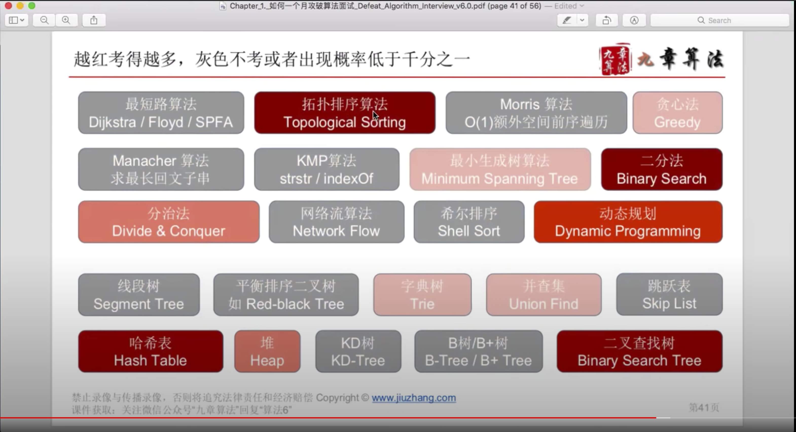
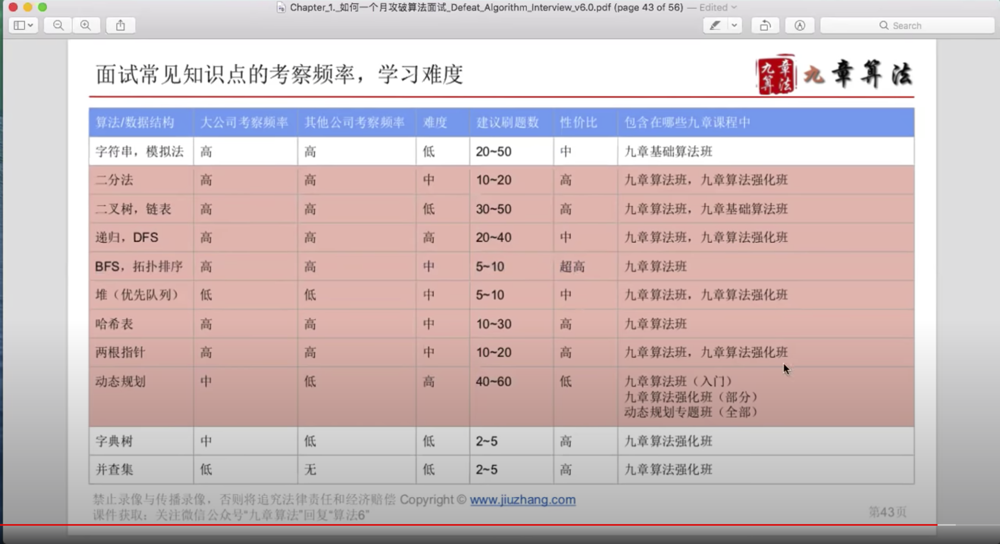
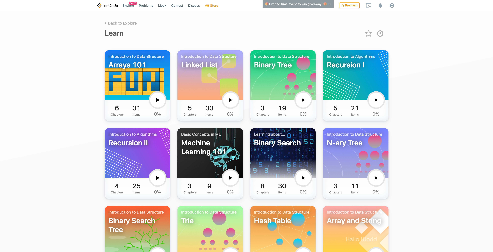
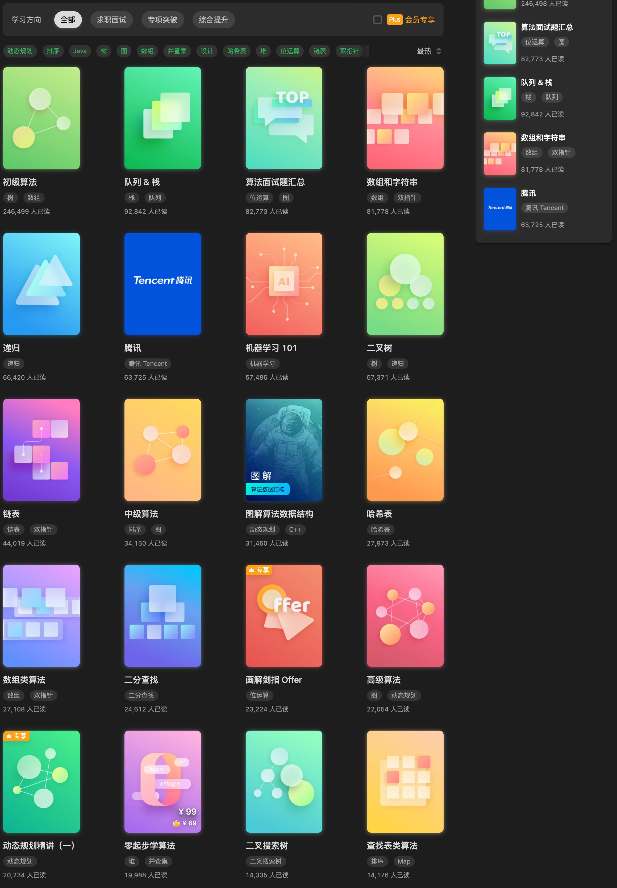
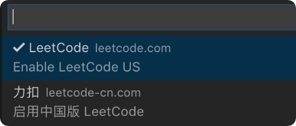
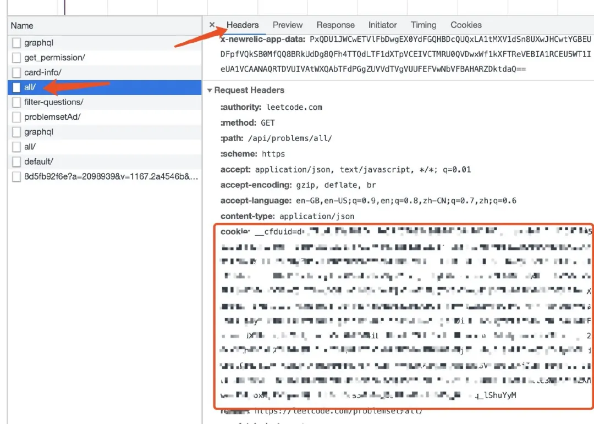
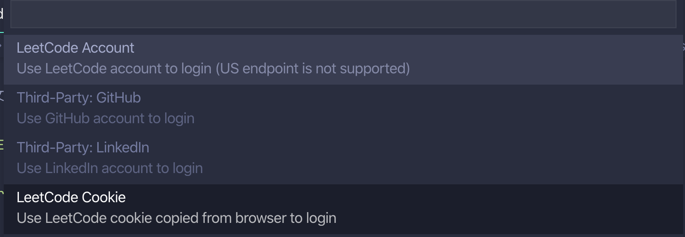
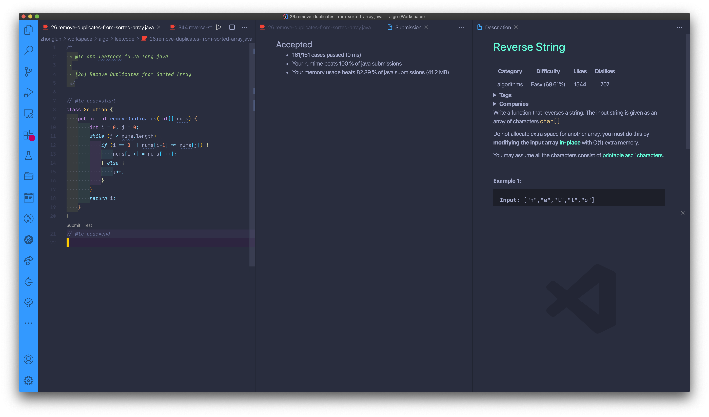
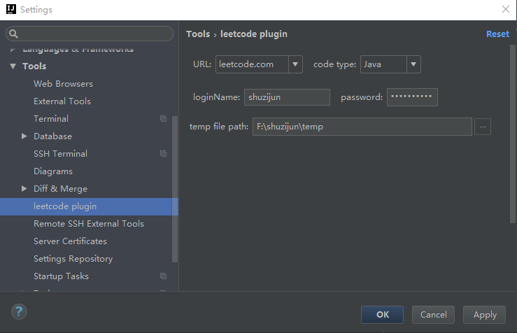
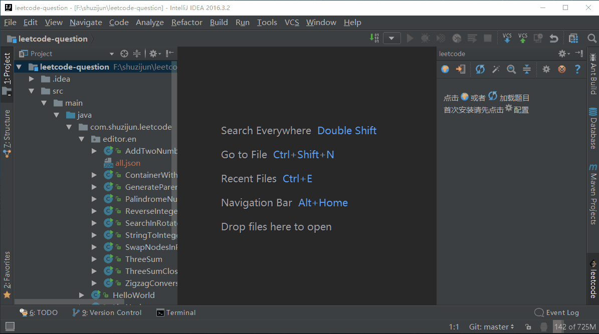

# Leetcode刷题指南 

> 冲着算法编程面试去的，不是学校计算机系里学的那种

## 1. 数据结构与算法课程（基础）


如果没学过或者学了忘记的，可以参考以下课程（基本我都看过），都是高手，强烈推荐：

- [Data Structures Easy to Advanced Course - Full Tutorial from a Google Engineer](https://www.youtube.com/watch?v=RBSGKlAvoiM)：数据结构基础课程，前 Google 员工和 ACM 顶级高手，讲得很清楚，其它数据结构参考 <i class="fas fa-external-link-alt"></i>[他的油管channel](https://www.youtube.com/c/WilliamFiset-videos/playlists)。
- [Data Structures - Computer Science Course for Beginners](https://www.youtube.com/watch?v=zg9ih6SVACc)：Course created by Steven from NullPointer Exception，学习最常见的 12 种数据结构，同样讲得很清楚。
- 慕课网 [liuyubobobo 的算法课 ](https://www.imooc.com/t/108955) ：有好几个课程，从数据结构，到算法面试，到算法应用，讲得非常接地气，可以补补基础，非常推荐
- 极客时间王争的专栏 [数据结构与算法之美 ](https://time.geekbang.org/column/intro/126)：数据结构与算法学习重点提示和总结，可以用来快速回忆
- 2021 年开课吧最新录制 [美女老师带你轻松搞定数据结构与算法，搭建你的编程与算法基础]()
- 极客时间贾超 [70 天的算法训练营 ](https://u.geekbang.org/subject/algorithm/1000343) ：网上非常出名的课程，知识点覆盖全面，主要针对 leetcode 系统性讲解 ⏤ 如何练，怎们练，正在跟着一遍下来
- 左神 左程云
   - [2021 最新左神数据结构算法全家桶，（基础到高级篇）LeetCode 真题详解 BAT 等高频面试题，进大厂的必修算法课](https://www.bilibili.com/video/BV1Vb4y1f7kK)  
   - [人人都能看的懂：左神--左程云 2021 版【LeetCode 算法面试刷题教程】](https://www.bilibili.com/video/BV1854y1Y7qX)

以上课程，b 站、油管、网盘全部都有 💯 🆓 ，自行寻找。

MIT，Stanford，CMU，Coursera，Edx，Udacity 上都有大学的数据结构与算法的公开课，虽然很好，但学习时间较长，不走学术和研究路线的话不建议采用。

可以结合刷题来巩固知识点。如果没有编程基础，推荐使用 Python 来学习和刷题。

## 2. 刷题策略

- ==策略 A：突击==

  - 前两百多道都是经典题，先刷热题 HOT 100 ～ 200，再刷精选 TOP 面试题，之后刷其他的题。

    

    

  - easy/hard 一般不会考，碰到 hard 的就缴枪自认倒霉吧

  - 一些算法是冷门，同样如果万一碰到了就自认倒霉吧

    

- ==策略 B：循序渐进==

  1. 基础：Leetcode -> Explore -> Learn 针对各个数据结构和算法的分类学习 + 练习:
     

     Leetcode 中文站的资料就更多：https://leetcode-cn.com/leetbook/

     

     算法基础好的或者学校刚毕业的可以跳过这部分，直接刷题。

  2. 针对每个 topic 强化刷题，包括套路和特定类型的问题：Leetcode -> Problems -> Tags 选择 topics，参考下面的 [5. 刷题线路（精华题）](#5. 刷题线路（精华题）)
  3. 面试前针对某个具体公司刷题：Leetcode -> Problems -> Tags 选择公司

## 3. 刷题方法

极客算法训练营推荐的==五遍刷题法/五毒神掌==：

```markdown
1.   刷题第一遍
    -   5~10 分钟读题加思考
    -   然后直接看解法。注意！多解法，比较解法优劣
    -   背诵、默写好的解法
2.   刷题第二遍
    -   马上自己写 -> 提交到 Leetcode 反复 debug 至通过
    -   多种解法比较、体会 -> 优化，Leetcode 有统计执行时间和内存消耗
3.   刷题第三遍
    -   过了一天后，再重复做题
    -   不同解法的熟练程度 -> 专项练习
4.   刷题第四遍
    -   过了一周再反复回来练习，同时对于不熟练的题目再进行专项练习
5.   刷题第五遍
    -   面试前一周恢复性训练
```

## 4. 刷题线路（新手）

还不知道如何刷题的话，别人已经整理好具体的新手计划，跟着上手：

- [{30 DAYS}](https://30dayscoding.com/)

  ```markdown
  Work towards becoming a better developer by going through the awesome resources that we've compiled for you. This covers all the important data structures and algorithms that you need, to improve your problem solving skills. Take advantage of the amazing free content out there for free, set your right mindset and get going!
  ```


- [100 天摆脱算法小白（作者：小浩）](https://github.com/geekxh/hello-interview)

  ```markdown
  我曾发起一个项目 hello-algorithm，从上线到获得 8k star 只用了不到半个月的时间，且登上过 github trending 日榜榜首的位置。但是该项目在我看来却有一定局限性，由于资源性质过重，并不能让大家真正参与进来。同时，也没有系统的给出一套完整的算法训练步骤。在这样的背景下，我重新创建了现在这个项目：Algorithm-100-Days，期望可以提供一套完整的算法训练，并对每一节学习内容都提供了视频。
  ```


- [算法模板（Go/Java/Python/Javascript）](https://greyireland.gitbook.io/algorithm-pattern/)

  ```markdown
  算法模板，最科学的刷题方式，最快速的刷题路径，一个月从入门到 offer，你值得拥有此项目是自己找工作时，从 0 开始刷 LeetCode 的心得记录，通过各种刷题文章、专栏、视频等总结了一套自己的刷题模板。这个模板主要是介绍了一些通用的刷题模板，以及一些常见问题，如到底要刷多少题，按什么顺序来刷题，如何提高刷题效率等。
  ```


## 5. 刷题线路（精华题）

- [图灵星球：LeetCode 精华题目列表【刷题规划系列】](https://turingplanet.org/2020/09/18/leetcode_planning_list/)
  [图灵星球：刷题方法论](https://turingplanet.org/2020/09/20/leetcode_how_to/) 👍🏻

  ```markdown
  星友们好呀~ 我是以诺，一位 Cal Poly Pomona 的在读研究生。我爱编程，爱科技，也是个爱沉浸在科幻世界里的白日梦患者哈哈
  :P
  ```


- [小浩算法](https://www.geekxh.com/)

  ```markdown
  小浩算法是我在疫情期间完成的一部图解算法题典！目前共完成 105道 高频面试算法题目，全部采用漫画图解的方式。该教程目前共有 11w 人阅读。
  ```


- [Leetcode Animation All in On]()

  ```Markdown
  程序员小吴，一个终生学习编程的程序员。
  
  我会尽力将 LeetCode 上所有的题目都用动画的形式演示出来，计划用 3 到 4 年时间去完成它，期待与你见证这一天！
  
  文章最新首发于微信公众号 五分钟学算法，您可以关注获取最新的文章。
  ```

  

- [袁厨的算法小屋](https://www.geekxh.com/)

  ```markdown
  专门为刚开始刷题的同学准备的算法基地，没有最细只有更细，立志用动画将晦涩难懂的算法说的通俗易懂！
  ```

  

- [代码随想录/程序员 Carl：LeetCode 刷题攻略](https://github.com/youngyangyang04/leetcode-master)

  ```markdown
  家好，我是程序员 Carl，哈工大师兄，ACM 校赛、黑龙江省赛、东北四省赛金牌、亚洲区域赛铜牌获得者，先后在腾讯和百度从事后端技术研发，CSDN 博客专家。对算法和 C++后端技术有一定的见解，利用工作之余重新刷 leetcode。
  
  200道经典题目刷题顺序，共60w字的详细图解，视频难点剖析，50余张思维导图，从此算法学习不再迷茫！
  ```

  

- [算法珠玑](https://algorithm-essentials.soulmachine.me/)

  ```markdown
  @灵魂机器
  举一反三，以少胜多，告别题海战术
  一个最精简的题库，150 道左右
  ```


- [算法·进阶石（algorithm-stone）](https://github.com/acm-clan/algorithm-stone)

  ```markdown
  本项目是公众号《ACM 算法日常》整理的一个算法学习路线图。
  ```

## 6. 套路 & 模版

- [图灵星球：LeetCode 刷题系列 (Java)](https://turingplanet.org/leetcode刷题系列/)
- [AlgoWiki 力扣刷题模板](https://ojeveryday.github.io/AlgoWiki/#/)
- [九章算法：令狐冲的算法小抄](https://github.com/ninechapter-algorithm/linghu-algorithm-templete)
- [labuladong 的算法小抄](https://labuladong.gitbook.io/algo/)
- [李威威](https://www.liwei.party/categories/)
- [Algorithms and Coding Interviews](https://medium.com/algorithms-and-leetcode)

## 7. 题解

### 7.1. 中文讲解

油管和 B 站上都有很多人在讲解，可自行搜索，同一题有时需要交叉听听不同人的讲解：


- 💁🏻‍♂️ 花花酱

  ```markdown
  花花酱讲解 LeetCode 题目已经很多年了，一直更新，属于老字号。他针对不同题型开辟了各种算法专题，涵盖了 LeetCode 上很广泛的各类题型，比较适合刚刚入门的同学进行系统性分块学习。而且花花酱更新频率比较高，平时的 contest 也会参加，会分享一些解题思路。
  ```

  - 油管：[花花酱 LeetCode 视频讲解](https://docs.google.com/spreadsheets/d/1HV-iKgYJL4DpSOX1M-HcYG1cmz5CQxoduLOdEoTnIXo/edit#gid=0)

  - B 站：[花花酱 LeetCode](https://space.bilibili.com/9880352)

  - 网站：https://zxi.mytechroad.com/blog/

    

- 💁🏻‍♂️ 篮子王

  ```markdown
  篮子王可能是油管上最好的中文视频讲解:P。篮子王不更新了，不过上传的解题视频中，已经覆盖了很多高频题。
  ```

  - 油管：[basketwangCoding](https://www.youtube.com/playlist?list=PLH8TFsY0qnE2R9kf_9vahNY6pG9601z_4)（Java 版）

  - B 站：[basketwangCoding](https://space.bilibili.com/108657656)

    

- 💁🏻‍♂️ 小小福

  - 油管：[FuFu LeetCode](https://www.youtube.com/channel/UCCMpGENpr93ENbfdinP3QeQ/playlists)

  - B 站：[小小福 Leetcode 力扣讲解](https://space.bilibili.com/440336692/channel/detail?cid=99774&ctype=0)

    

- 💁🏻‍♂️ 古城算法

  - 油管：[古城算法](https://www.youtube.com/c/古城算法/playlists)
  
  - B 站：[古城算法](https://space.bilibili.com/21630984/channel/detail?cid=162960&ctype=0)
  
    

### 7.2. 英文讲解（课程）

很好但需要花钱购买，盗版的自己找 🙈

- [Zero to Master Master the Coding Interview: Big Tech (FAANG) Interviews](https://academy.zerotomastery.io/p/master-the-coding-interview-faang-interview-prep)
  油管：[Coding Interview Prep | Master LeetCode | Get Hired](https://www.youtube.com/playlist?list=PL2HX_yT71umC1tZjYtaEmmG6U4pVRXt58)
  
  
  
- [Back To Back SWE](https://backtobackswe.com/)
  油管：[Software Engineering Interviews](https://www.youtube.com/playlist?list=PLiQ766zSC5jPIKibTa5qtXpwgwEBalDV4)
  
  
  
- [AlgoExpert](https://www.algoexpert.io/product)（100 道）

  

- [InterviewPro](https://www.techseries.dev/)（100 道）

  

- [Interview Cake](https://www.interviewcake.com/)

  

### 7.3. 各路大神作业

- Java/Go/C++：[LeetCode-book：LeetCode 1~400 题总结 + 专题知识点&题型总结](https://github.com/huxiaoman7/leetcodebook)
- Java：[作者先后面试了近三十多家互联网公司](https://github.com/yuanguangxin/LeetCode)
- Go：[Solutions to LeetCode by Go, 100% test coverage, runtime beats 100% / LeetCode 题解](https://books.halfrost.com/leetcode/)
- C：[LeetCode in pure C](https://github.com/begeekmyfriend/leetcode)
- Javascrip/Python：[力扣加加 - 努力做西湖区最好的算法题解](https://leetcode-solution-leetcode-pp.gitbook.io/leetcode-solution/)
- Java：[Cspiration 1-300](https://github.com/JojoYang666/Leetcode-1-300) [301 - 600](https://github.com/JojoYang666/Leetcode-301-600)
- 各种算法的实现（几乎涵盖所有的编程语言）：[TheAlgorithms](https://the-algorithms.com/)

## 8. 刷题利器

### 8.1. VS Code 插件

<i class="fas fa-download"></i>[下载](https://github.com/jdneo/vscode-leetcode/blob/master/docs/README_zh-CN.md)

VS Code里安装插件后： 

1. 唤出 Leetcode

   

2. 先 Switch Endpoint 选“中国” or “US”，两边 leetcode 不同
   

   

3. Sign in：⚠️ 注意 leetcode US 已经不能支持账号 Sign in，必须通过 cookie（从 Chrome 浏览器中 login，然后把完整的 cookie 拷贝过来)
   

   

4. 接下来点击最右边导航条上 leetcode 标签
   

5. 开刷
   

## 8.2. IntelliJ 插件

<i class="fas fa-download"></i>[下载](https://plugins.jetbrains.com/plugin/12132-leetcode-editor)

IntelliJ里安装插件后： 

1. 配置
   

2. 使用
   
   

### 8.3. Chrome 插件

<i class="fas fa-download"></i>[下载](https://mp.weixin.qq.com/s/3hvFH2Ry1hoJoUe5plEElg)

## 9. 小结

LeetCode 应该是最好的，不够的话还有 [InterviewBit](https://www.interviewbit.com/)，[GG](https://www.geeksforgeeks.org/)，[Google’s Coding Competitions](https://codingcompetitions.withgoogle.com/)，[TopCoder](https://www.topcoder.com/challenges/?pageIndex=1)，[HackerRank](https://www.hackerrank.com/domains)，[《挑战程序设计竞赛》](https://github.com/guanhui07/studyFiles/blob/master/算法/挑战程序设计竞赛(第2版).pdf)，[《算法竞赛进阶指南》](https://github.com/lydrainbowcat/tedukuri)等等。

如果你不想做 CRUD 的程序员，但每天写的东西就是在屎山上堆屎，刷题就是另一个路径，是一种刻意训练，提高编程功底，开拓思维。听说，很多高手也在“悄悄”的刷。

<i class="fas fa-map-marker-alt"></i> 小结：

> - 如果有编程经验的，用什么语言刷题一点都不重要，因为语言层面只用到最最基本的东西（int，string，array，if/else，for/while 等）
> - 刷题之前先把数据结构和基本算法过一遍，把基础打牢
> - 刷题没有捷径，只有策略和积累，无论按照怎样的顺序、策略来刷题，想要灭考官，都需要经历 `题海战术`
> - 只刷题还不够，一定要回顾总结，掌握套路 & 模板


# 数据结构与算法


# 解题套路 & 模版


<span class="kwd">keyword</span> 

<span class="label">label</span> 

<span class="uline">underline</span> 


<head>     
    <script defer src="https://use.fontawesome.com/releases/v5.15.3/js/all.js"></script>     
    <script defer src="https://use.fontawesome.com/releases/v5.15.3/js/v4-shims.js"></script>  
</head>  

<link rel="stylesheet" href="https://use.fontawesome.com/releases/v5.15.3/css/all.css">


